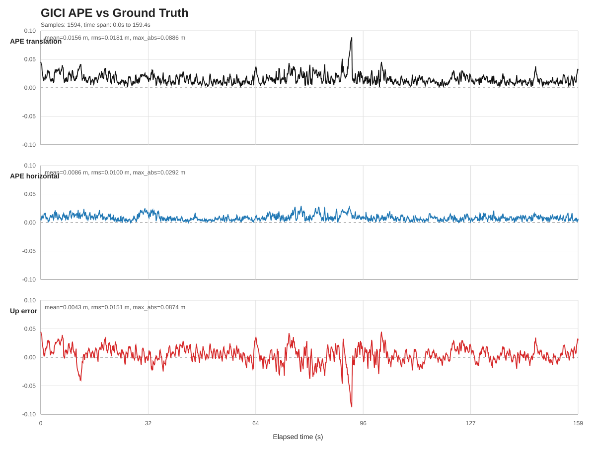
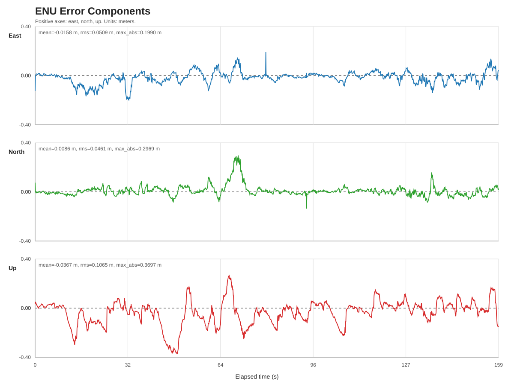
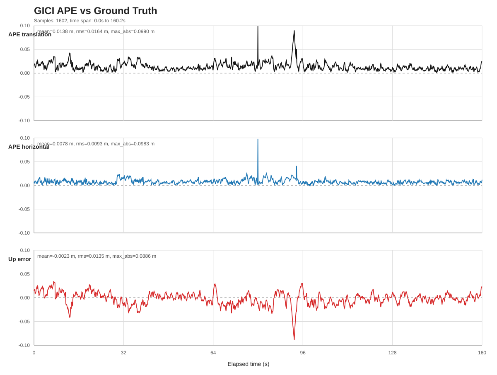
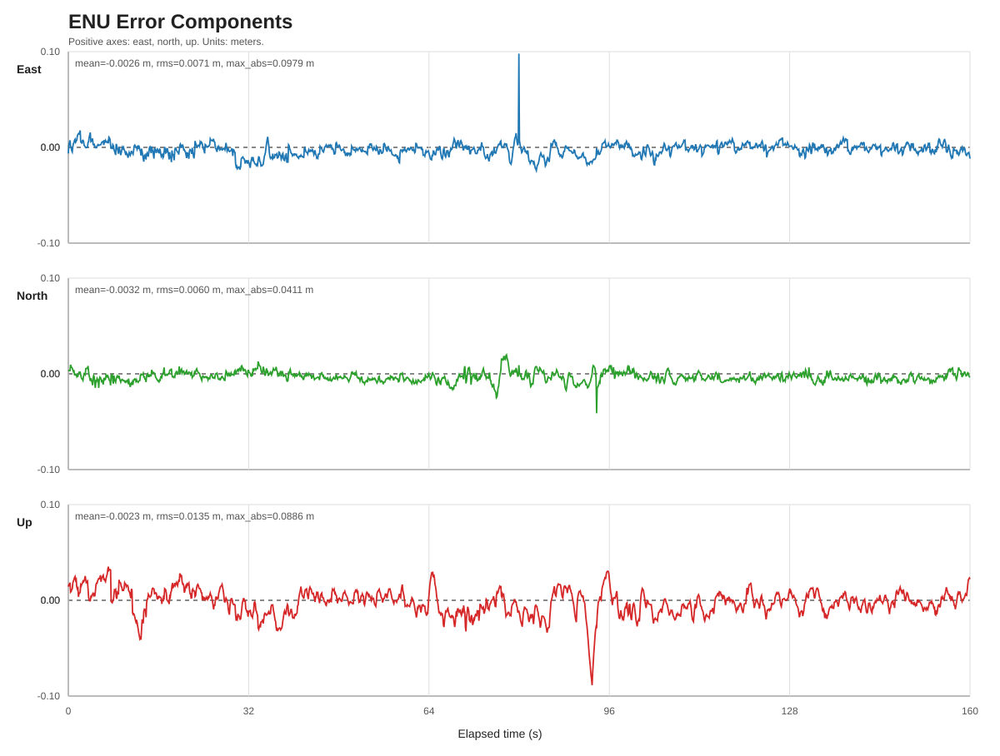
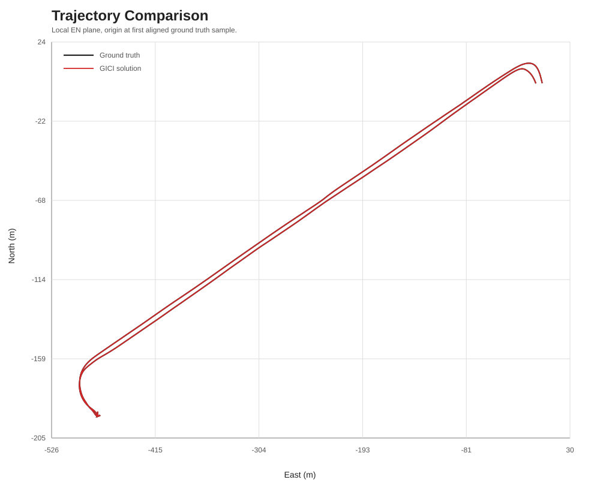

# GICI 实验记录

## 2026-05-28（本次新增）

### 本次修改内容

- 将 RTK-RRR 仿实时回放速度 `replay.speed` 降低到 `0.25`，用于解决日志中的 backend pending 队列积压问题。
- 重新运行 `tools/visualization/test_plot_position_error.py`，确认评估脚本测试通过。
- 重新运行 `tools/visualization/plot_position_error.py`，基于最新 `output/rtk_rrr_evaluation.csv` 和 `option/intrinsics_and_extrinsics.yaml` 生成 RTK-RRR 误差评估。
- 更新 `tools/visualization/output_rrr` 下的 `ape.csv`、`summary.txt` 和 SVG 图表。

### RTK-RRR 评估结果（本次新增）

| 指标 | 结果 |
| --- | ---: |
| aligned samples | `1594` |
| duration | `159.357 s` |
| 3D APE mean | `0.015590 m` |
| 3D APE RMS | `0.018120 m` |
| 3D APE max_abs | `0.088551 m` |
| horizontal APE RMS | `0.009987 m` |
| attitude error RMS | `0.472107 deg` |
| east error RMS | `0.007395 m` |
| north error RMS | `0.006712 m` |
| up error RMS | `0.015119 m` |

### RTK-RRR 输出图（本次新增）

## 2026-05-24-27

### 进展

- 将 Python APE 评估升级为完整姿态矩阵计算。
- 使用 `T_B_GT` 同时修正 ground truth 位置参考点和姿态坐标系。
- 新增姿态 APE 输出，并重新生成 RTK-TC 的 CSV、summary 和 SVG 结果。
- 修改 RTK-RRR YAML，补齐本地数据路径、evaluation 输出和日志路径。
- 编译并运行 RTK-RRR，生成 `output/rtk_rrr_*` 结果文件。
- 使用完整姿态矩阵重新评估 RTK-RRR，并生成 `tools/visualization/output_rrr` 下的图表。

※※※※**未解决：
-pending问题**
### APE 结果

| 模式 | 位置 APE RMS | 水平 APE RMS | 姿态 APE RMS |
| --- | ---: | ---: | ---: |
| RTK-TC | `0.0164 m` | `0.0093 m` | `0.5402 deg` |
| RTK-RRR | `0.1267 m` | `0.0687 m` | `0.5206 deg` |

### RTK-TC 输出图

### RTK-RRR 输出图

